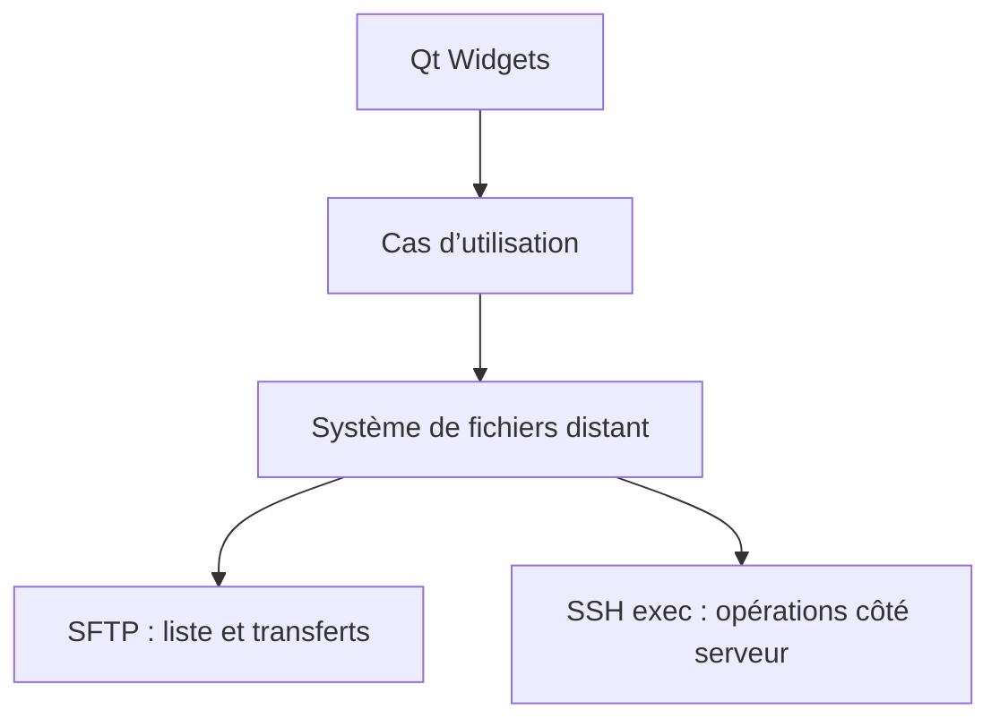

# Architecture

## Couches

| Couche | Cible CMake | Responsabilité |
| --- | --- | --- |
| Interface | `rfm_ui` | Fenêtres, navigation, actions et retours utilisateur Qt Widgets |
| Cœur | `rfm_core` | Profils, chemins distants, modèles, règles métier et orchestration testable |
| Transport | `rfm_core` (`src/ssh`) | Backend libssh, session SSH, SFTP et commandes serveur dans un worker dédié |
| Exécutable | `RemoteFileManager` | Démarrage de l’application et assemblage des couches |

La règle principale est que l’interface ne doit jamais manipuler directement `ssh_session`, `sftp_session` ou un autre type de libssh. Elle déclenche des intentions et reçoit des résultats métier.

## Flux prévu

## Asynchronisme

Le thread principal reste réservé à Qt. Les connexions et opérations réseau sont exécutées dans un
worker avec une file de tâches. Les transferts et copies serveur longues avancent par étapes bornées
réordonnancées dans la boucle d'événements afin que le worker puisse traiter navigation, annulation
et arrêt propre entre deux étapes.

## Opérations distantes

- SFTP servira à lister, lire les métadonnées, transférer et renommer lorsque le protocole le permet.
- Les copies importantes entre deux chemins du même serveur devront rester côté serveur pour éviter un aller-retour des données par le client.
- `cp` n’expose pas nativement une progression exploitable. Une copie active affiche donc une
  progression indéterminée honnête ; aucun pourcentage n'est estimé ou fabriqué.
- Les commandes distantes devront être construites et échappées dans une couche dédiée ; aucun chemin fourni par l’utilisateur ne sera concaténé naïvement dans une commande shell.
- Les opérations de fichiers dépendent de `RemoteFileBackend`, dont l’implémentation libssh reste privée au transport. Les tests utilisent un double sans connexion réseau.
- La copie distante utilise actuellement `cp -P -n` via un canal SSH non bloquant, faute de
  primitive de copie serveur exposée par SFTP/libssh. Ses arguments sont échappés séparément, les
  collisions sont refusées avant et pendant l'exécution, les liens symboliques restent des liens et
  l'annulation envoie `TERM` au processus distant avant de fermer le canal.
- Le chemin SFTP initial est canonicalisé en chemin absolu. Ainsi, le dossier de connexion n'est pas
  confondu avec `/` et la navigation parent peut atteindre la vraie racine distante.
- Les chemins de téléchargement locaux sont construits composant par composant. Chaque composant
  est validé selon la plateforme cliente et le résultat doit rester lexicalement sous le dossier
  choisi, sans imposer ces contraintes locales aux noms distants utilisés sur le serveur.

## Portabilité

La priorité du prototype est Linux. Qt, CMake et libssh ont été retenus pour ne pas enfermer le cœur dans Linux : le même code doit pouvoir être construit ensuite sous Windows et macOS, avec seulement des adaptations d’intégration système et de packaging.
