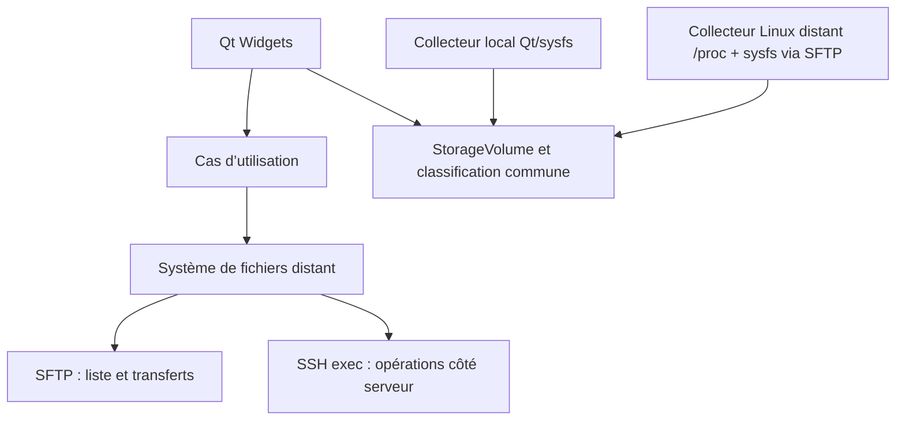

# Architecture

## Couches

| Couche | Cible CMake | Responsabilité |
| --- | --- | --- |
| Interface | `rfm_ui` | Fenêtres, navigation, actions et retours utilisateur Qt Widgets |
| Cœur | `rfm_core` | Profils, chemins distants, modèles, règles métier et orchestration testable |
| Transport | `rfm_core` (`src/ssh`) | Backend libssh, session SSH, SFTP et commandes serveur dans un worker dédié |
| Exécutable | `RemoteFileManager` | Démarrage de l’application et assemblage des couches |

La règle principale est que l’interface ne doit jamais manipuler directement `ssh_session`, `sftp_session` ou un autre type de libssh. Elle déclenche des intentions et reçoit des résultats métier.

## Flux actuel

## Asynchronisme

Le thread principal reste réservé à Qt. Les connexions et opérations réseau sont exécutées dans un
worker avec une file de tâches. Les transferts et copies serveur longues avancent par étapes bornées
réordonnancées dans la boucle d'événements afin que le worker puisse traiter navigation, annulation
et arrêt propre entre deux étapes.

L'admission des opérations longues est séparée de leur exécution. `TransferCoordinator`, dans le
thread graphique mais sans aucune I/O, possède deux voies FIFO indépendantes : une pour les
Upload/Download et une commune aux Remote Copy/Move. Chaque voie conserve au plus une requête active,
ce qui préserve la concurrence existante entre un transfert SFTP et une copie serveur. Le coordinateur
publie seul `Queued`, route les annulations et choisit la prochaine requête de chaque voie.
`SshSession` ne choisit jamais le travail suivant : elle exécute uniquement les jobs dispatchés et
publie leur travail effectif à partir de `Preparing`. Après le terminal et le résultat métier d'un
Copy/Move, le coordinateur libère son slot puis décide seul du dispatch suivant. Une indisponibilité
fatale de l'exécuteur est signalée avant sa destruction ; le coordinateur échoue alors les actifs et
les requêtes encore queued sans connaître libssh ni démarrer un nouveau job. Le shutdown et la
déconnexion extraient les deux queues avant de demander le nettoyage coopératif des jobs actifs au
worker.

La découverte des volumes utilise la même discipline : `LocalFileSystemWorker` lit
la machine cliente et `SshSession` lit le serveur connecté. Les deux collecteurs
produisent les mêmes preuves topologiques et délèguent la décision métier à
`Storage.cpp`. Un niveau sysfs sans lien `subsystem` est conservé comme niveau vide,
tandis qu'une permission refusée ou une erreur d'I/O invalide explicitement la
fiabilité ; seule la fin réelle de l'ascendance rend la topologie complète. Un
périphérique bloc dont le parcours est incomplet reste donc `Unknown`.
La lecture distante avance par étapes réordonnancées dans la boucle du worker SSH.
`mountinfo` reste ouvert pendant la collecte, mais chaque étape n'effectue qu'une
lecture SFTP bornée avant de rendre la main à la boucle d'évènements.
Quand `mountinfo` expose un numéro virtuel `0:*` pour un filesystem tel que Btrfs,
le scanner ne conclut pas à l'absence de bloc. Une source absolue sous `/dev` est
canonicalisée, son véritable `major:minor` est lu dans `/sys/class/block/<nom>/dev`,
puis le parcours habituel reprend dans `/sys/dev/block`. Le transport peut ainsi être
trouvé sur un parent sysfs, sans déduire le type matériel du nom du périphérique.
La taille de `mountinfo`, le nombre de montages et labels, ainsi que le travail sysfs
total sont bornés. Une nouvelle requête, une déconnexion ou le shutdown annule le
snapshot en cours ; une perte de connexion supprime tout résultat partiel et rejoint
le chemin de déconnexion existant.
Le même modèle porte également le label, le modèle matériel, le périphérique et le
point de montage. Le choix du nom humain est centralisé ; l'arbre utilise toujours le
point de montage stocké pour naviguer et ne déduit jamais un chemin du texte affiché.
Pour un périphérique bloc Linux, `StorageVolume` transporte aussi son identité noyau
`major:minor`. La fusion rapproche ainsi les alias d'un même device (par exemple un
chemin device-mapper et son chemin noyau) sans confondre deux partitions distinctes ;
le chemin `/dev` observé reste la cible des opérations de montage.

Le menu contextuel de Places est calculé à partir de la ligne située sous le clic, et
non de la sélection précédente. Il ne publie que les intentions compatibles avec le
type de nœud ; l'ouverture et les opérations de volume réutilisent les signaux de
`NavigationTree`, tandis que les propriétés d'un serveur enregistré réutilisent son
dialogue de profil.
Le navigateur principal conserve aussi le `RemoteEntry` déjà reçu sur chaque ligne :
son action `Properties` présente cet instantané sans nouveau parcours local récursif
ni requête SFTP. Le type utilisateur d'un fichier est déduit uniquement de son nom
avec la base MIME Qt en mode extension ; un type absent ou technique retombe sur
`File`.

## Opérations distantes

- Remote Copy et Remote Move partagent une voie FIFO du `TransferCoordinator`. Une requête queued peut
  être annulée sans créer de `ServerSideCopyJob`; le coordinateur publie alors `Cancelled` et un
  résultat métier synthétique afin que l'UI nettoie contexte et clipboard par son chemin habituel.
  L'annulation active reste coopérative et ne libère le slot qu'après le terminal et le résultat de
  l'exécuteur. Shutdown, déconnexion et perte SSH terminalisent la queue sans nouveau dispatch.
- SFTP sert à lister, lire les métadonnées, transférer et renommer lorsque le protocole le permet.
- Sur Linux distant, SFTP lit également `/proc/self/mountinfo` et `/sys/dev/block` en
  lecture seule pour découvrir les volumes, sans commande shell ni privilège accru.
- Les copies entre deux chemins du même serveur restent côté serveur pour éviter un aller-retour des données par le client.
- `cp` n’expose pas nativement une progression exploitable. Une copie active affiche donc une
  progression indéterminée honnête ; aucun pourcentage n'est estimé ou fabriqué.
- Les commandes distantes sont construites et échappées dans une couche dédiée ; aucun chemin fourni par l’utilisateur n’est concaténé naïvement dans une commande shell.
- Les opérations de fichiers dépendent de `RemoteFileBackend`, dont l’implémentation libssh reste privée au transport. Les tests utilisent un double sans connexion réseau.
- La copie distante utilise `cp -P -n` via un canal SSH non bloquant, faute de primitive de copie
  serveur exposée par SFTP/libssh. Pour chaque élément, elle réserve atomiquement dans le dossier
  destination un répertoire court `.rfm-copy-<uuid>.partial`, donc sur le même filesystem et
  indépendamment de la longueur du nom final, puis copie vers son enfant `item`. Le fallback Move
  utilise de même `.rfm-move-<uuid>.partial`. Tant qu'un job possède ce chemin exact, les listings le
  masquent et les opérations UI le refusent comme source ou cible. Un staging abandonné par un job
  terminal ou une ancienne session redevient visible : aucun motif de nom n'est filtré globalement.
  Le nom final reste absent pendant la copie. Après le succès réel de
  `cp`, sa disponibilité est revérifiée et `item` est promu par rename SFTP. Le staging alors attendu
  vide est supprimé uniquement par `sftp_rmdir`, sans shell, suppression récursive ni lecture de
  `mountinfo`. Un échec de ce `rmdir`, y compris parce que le répertoire n'est pas vide, conserve le
  fichier final et le staging, puis publie `Failed` avec son chemin, sans fallback récursif. Avant la
  promotion, une annulation ou une erreur peut laisser un arbre partiel : le cleanup récursif protégé
  reste alors utilisé et doit finir avant le terminal. L'annulation attend la terminaison du processus
  puis ce nettoyage avant de publier `Cancelled` ; un échec conserve un diagnostic avec le chemin du
  staging éventuellement restant.
  Les arguments restent échappés séparément et la sémantique Copy demeure distincte du fallback
  Move : `-P`, `-R` seulement pour un dossier et `-n`, sans remplacement implicite par `cp -a`.
  Copy et le fallback Move exécutent cependant `cp` sous un wrapper commun qui publie son statut
  in-band. Le wrapper intercepte `TERM`, le transmet au PID de `cp` et attend sa terminaison avant de
  fermer le canal ; EOF ou un callback SSH tardif ne peut donc ni fabriquer un succès ni contredire
  un statut vérifié. Une perte de transport terminalise le job avant sa destruction : les éléments
  déjà promus et nettoyés restent réussis, l'élément actif indique son staging potentiellement
  restant et les éléments non démarrés sont distingués dans le résultat métier réel.
- Un déplacement tente d'abord le rename SFTP. Comme SFTP v3 réduit `EXDEV` à une erreur
  générique, le transport ne qualifie le fallback qu'après comparaison par `statvfs` des
  répertoires qui contiennent les entrées source et destination. Il vérifie aussi que l'entrée
  source n'est pas elle-même un point de montage d'après `/proc/self/mountinfo` ; une preuve
  absente, ambiguë ou illisible refuse le fallback. Le parent de la source est canonicalisé
  sans suivre le dernier composant, afin de traiter de la même façon fichiers, dossiers, liens
  symboliques valides ou cassés.
- Le fallback réserve atomiquement par SFTP un répertoire temporaire aléatoire en mode `0700`
  sur le filesystem cible. La copie de déplacement utilise `cp -a` dans ce répertoire : elle
  préserve liens, modes, dates, propriétaires lorsque les droits le permettent, ACL, attributs
  étendus, capabilities et liens physiques dans l'arbre copié. La copie distante ordinaire
  reste en `cp -P -n` et conserve donc sa sémantique existante. Le wrapper commun
  publie le code de retour dans stdout avant EOF : le worker peut ainsi valider une copie
  courte même si la notification SSH `exit-status` arrive tardivement, tout en refusant une
  incohérence entre les deux statuts lorsqu'ils sont tous deux disponibles.
- Après la copie, le worker promeut l'enfant temporaire par rename SFTP, nettoie le répertoire
  temporaire, puis supprime la source. Tout nettoyage est coopératif et non bloquant, y compris
  après erreur, annulation ou échec de promotion. La suppression récursive revérifie juste avant
  `rm` l'intégralité de `mountinfo`. Un point de montage égal à la cible ou situé sous sa frontière
  `cible/` refuse l'opération avant la première suppression ; un chemin partageant seulement son
  préfixe n'est pas confondu avec un descendant. Un `mountinfo` absent ou malformé refuse également
  l'opération : chaque ligne doit contenir deux IDs numériques, un `major:minor`, une racine et un
  point de montage absolus avec des échappements reconnus, les options, le séparateur `-`, puis les
  trois champs filesystem/source/super-options. Une seule ligne incomplète bloque tout le `rm`.
  `rm --one-file-system` reste une défense supplémentaire après cette validation. Un nettoyage
  impossible conserve l'erreur initiale, indique le chemin temporaire restant et empêche la
  suppression de la source. Le fallback dépend des outils GNU/Linux usuels et ne peut recréer une
  métadonnée que si le serveur, le filesystem et les droits du compte SSH l'autorisent ; les liens
  physiques ne sont préservés qu'à l'intérieur d'un même élément sélectionné.
- Le chemin SFTP initial est canonicalisé en chemin absolu. Ainsi, le dossier de connexion n'est pas
  confondu avec `/` et la navigation parent peut atteindre la vraie racine distante.
- Les chemins de téléchargement locaux sont construits composant par composant. Chaque composant
  est validé selon la plateforme cliente et le résultat doit rester lexicalement sous le dossier
  choisi, sans imposer ces contraintes locales aux noms distants utilisés sur le serveur.

## Portabilité

La priorité du prototype est Linux. Qt, CMake et libssh ont été retenus pour ne pas enfermer le cœur dans Linux : le même code doit pouvoir être construit ensuite sous Windows et macOS, avec seulement des adaptations d’intégration système et de packaging.
