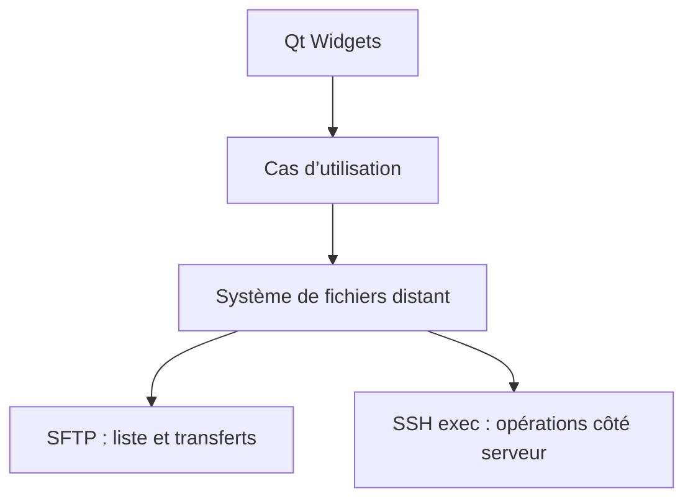

# Architecture

## Couches

| Couche | Cible CMake | Responsabilité |
| --- | --- | --- |
| Interface | `rfm_ui` | Fenêtres, navigation, actions et retours utilisateur Qt Widgets |
| Cœur | `rfm_core` | Profils, chemins distants, modèles, règles métier et orchestration testable |
| Transport | `rfm_core` (`src/ssh`) | Backend libssh, session SSH, SFTP et commandes serveur dans un worker dédié |
| Exécutable | `RemoteFileManager` | Démarrage de l’application et assemblage des couches |

La règle principale est que l’interface ne doit jamais manipuler directement `ssh_session`, `sftp_session` ou un autre type de libssh. Elle déclenche des intentions et reçoit des résultats métier.

## Flux prévu

## Asynchronisme

Le thread principal reste réservé à Qt. Les connexions et opérations réseau seront exécutées dans un worker avec une file de tâches. Les résultats remonteront par signaux Qt en connexion asynchrone. Une opération devra être annulable et posséder un identifiant stable pour alimenter plus tard la file de progression.

## Opérations distantes

- SFTP servira à lister, lire les métadonnées, transférer et renommer lorsque le protocole le permet.
- Les copies importantes entre deux chemins du même serveur devront rester côté serveur pour éviter un aller-retour des données par le client.
- `cp` et `mv` n’exposent pas nativement une progression exploitable. Une progression estimée pourra être ajoutée plus tard par observation des tailles ou par stratégie spécifique, sans créer de dépendance serveur obligatoire.
- Les commandes distantes devront être construites et échappées dans une couche dédiée ; aucun chemin fourni par l’utilisateur ne sera concaténé naïvement dans une commande shell.
- Les opérations de fichiers dépendent de `RemoteFileBackend`, dont l’implémentation libssh reste privée au transport. Les tests utilisent un double sans connexion réseau.
- La copie distante utilise actuellement `cp` via un canal SSH, faute de primitive de copie serveur exposée par SFTP/libssh. Ses arguments sont échappés séparément, les collisions sont refusées avant exécution et un serveur sans `cp` retourne une erreur explicite.

## Portabilité

La priorité du prototype est Linux. Qt, CMake et libssh ont été retenus pour ne pas enfermer le cœur dans Linux : le même code doit pouvoir être construit ensuite sous Windows et macOS, avec seulement des adaptations d’intégration système et de packaging.
