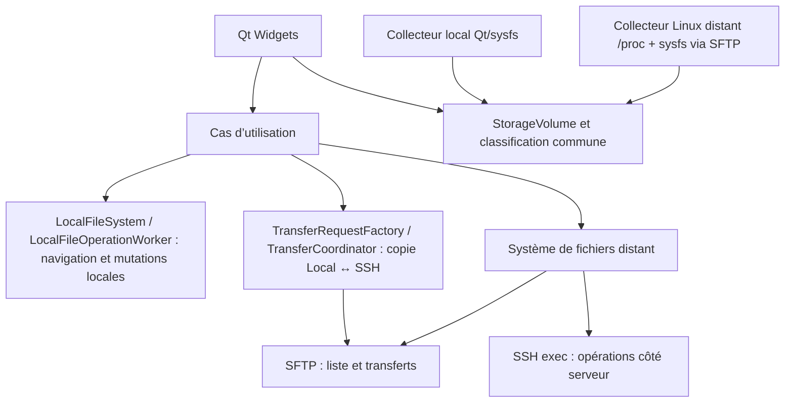

# Architecture

## Couches

| Couche | Cible CMake | Responsabilité |
| --- | --- | --- |
| Interface | `rfm_ui` | Fenêtres, navigation, actions et retours utilisateur Qt Widgets |
| Cœur | `rfm_core` | Profils, chemins distants, modèles, règles métier et orchestration testable |
| Transport | `rfm_core` (`src/ssh`) | Backend libssh, session SSH, SFTP et commandes serveur dans un worker dédié |
| Exécutable | `RemoteFileManager` | Démarrage de l’application et assemblage des couches |

La règle principale est que l’interface ne doit jamais manipuler directement `ssh_session`, `sftp_session` ou un autre type de libssh. Elle déclenche des intentions et reçoit des résultats métier.

Les capacités SFTP annoncées par le serveur sont représentées par un snapshot
`ServerCapabilities` du cœur, indépendant de libssh et distinct de
`ConnectionProfile`. Après chaque `sftp_init()` réussi, `SshSession` énumère les
extensions et relève la version du protocole avec l'API publique libssh, puis publie
le snapshot avec le profil de la connexion courante. L'état dérivé `copy-data` v1
n'est `Supported` que pour une extension annoncée dont le nom vaut `copy-data` et la
donnée vaut `1`; il reste `Unknown` avant détection et devient `Unsupported` après
une détection sans cette paire exacte. Ce snapshot décrit ce que le serveur annonce,
pas ce que le backend RFM sait nécessairement exécuter.

Le cœur représente séparément les méthodes réellement exécutables dans la session par
`RemoteCopyExecutionCapabilities`. `sftpCopyDataAvailable` décrit l'aptitude du backend
à invoquer l'extension, tandis que `nativeServerCopy` (`Unknown`, `Unsupported` ou
`Supported`) et `nativePrimitive` décrivent le résultat d'une sonde runtime. La seule
primitive native reconnue dans ce lot est `NativeServerCopyPrimitive::PosixCp`. Avec
libssh 0.12.2, le serveur peut annoncer `copy-data` v1, mais aucune API publique ne
permet à RFM de l'invoquer : le backend centralise donc
`sftpCopyDataAvailable == false`.

Après l'ouverture SFTP et la lecture initiale réussies, `SshSession` utilise son
exécuteur asynchrone de commandes SSH pour lancer la sonde fixe et sans écriture
`command -v cp >/dev/null 2>&1`. Un exit status 0 établit `PosixCp` comme `Supported` ;
un exit status non nul prouve seulement que cette primitive est `Unsupported`. Un
échec d'ouverture ou de lecture du canal, un timeout, une coupure de transport ou
l'absence d'exit status exploitable laisse la capability `Unknown` et ne fait pas
échouer à lui seul une connexion utilisable. Aucune déduction n'est faite depuis l'OS,
le hostname, OpenSSH, les chemins ou les extensions SFTP. L'état est conservé seulement
dans `SshSession` et revient à sa valeur inconnue dans `Impl::reset()` lors d'une
déconnexion.

`MainWindow` conserve le dernier snapshot en mémoire par identité de profil. Un profil
enregistré utilise son identifiant stable ; une connexion temporaire utilise l'identité
utilisateur/hôte/port, puis son snapshot est réassocié à l'identifiant créé si le profil
est enregistré après connexion. Les Properties d'un serveur transmettent uniquement le
snapshot correspondant à `ServerProfileDialog`. Son onglet `Capabilities` en lecture
seule distingue explicitement `Not detected`, `Last known` et `Currently detected`. Une
déconnexion conserve le snapshot courant, mais celui-ci est alors présenté comme dernier
résultat connu.

Les snapshots des seuls profils enregistrés sont persistés séparément des profils dans
`server-capabilities.json`. Le format JSON versionné v1 contient l'identifiant du profil,
une identité serveur non sensible (hôte, utilisateur et port), l'horodatage de détection,
la version SFTP optionnelle et la liste nom/donnée des extensions. Il ne contient aucun
paramètre d'authentification. `copy-data` est recalculé depuis cette liste afin d'éviter
deux sources de vérité. Le fichier est écrit atomiquement par `QSaveFile`; les fichiers
absents sont acceptés, les versions inconnues ou documents malformés sont signalés, et
les entrées partielles sont ignorées. Au chargement, les entrées orphelines ou dont
l'identité serveur ne correspond plus au profil sont ignorées. Une modification des
paramètres de connexion invalide le snapshot avant l'enregistrement du profil et une
suppression de profil supprime également son snapshot.

Un snapshot relu au démarrage est toujours une information `Last known`, jamais une
preuve de la connexion courante. Toute future connexion exécute à nouveau la découverte
réelle depuis le protocole SFTP et remplace ensuite le snapshot persistant. La découverte
reste fondée sur les capabilities annoncées par SFTP, et non sur le système d'exploitation
supposé du serveur. Les capabilities natives de copie ne sont jamais écrites dans
`server-capabilities.json` et un snapshot persistant ne peut donc jamais autoriser une
commande native.

Le cœur expose aussi une sélection pure de méthode de copie distante :

```text
ServerCapabilities
        +
RemoteCopyExecutionCapabilities
        ↓
selectRemoteCopyMethod()
        ↓
SftpCopyData
NativeServerCopy
ClientMediatedSftp
```

`SftpCopyData` exige à la fois un snapshot serveur courant et détecté annonçant la
révision 1, et un backend capable de l'invoquer. À défaut, une primitive native vérifiée
et identifiée sélectionne `NativeServerCopy`; tout état inconnu, incohérent ou non pris
en charge sélectionne le fallback conservateur `ClientMediatedSftp`. Avec le backend
libssh actuel, la stratégie disponible est donc `PosixCp` lorsqu'il a été vérifié, puis
SFTP médié par le client. `copy-data` reste la priorité future dans le modèle.

Pour chaque `RemoteOperationKind::Copy`, `SshSession` consomme désormais ce sélecteur
avec les deux snapshots runtime courants, puis configure `SshServerSideCopyBackend` :

```text
Remote Copy
    ↓
selectRemoteCopyMethod()
    ├─ SftpCopyData
    │      présent dans le modèle, mais non exécutable avec libssh 0.12.2
    ├─ NativeServerCopy / PosixCp
    │      cp côté serveur, sans transit des octets par RFM
    └─ ClientMediatedSftp
           sftp_read → client → sftp_write
```

Le chemin `PosixCp` réutilise le processus SSH coopératif existant, son protocole de
statut et sa terminaison par signal. La commande emploie uniquement les options POSIX
`-P`, `-p` et, pour un dossier, `-R`; ses arguments sont protégés par le quoting shell
à apostrophes déjà centralisé dans `RemoteCopyCommand`. `-n` et `--`, non garantis par
POSIX, ne sont pas nécessaires car la destination `staging/item` est réservée et vérifiée
absente avant le lancement. `-P` préserve les liens symboliques sans les déréférencer ;
le fallback SFTP reste plus restrictif et refuse les liens qu'il ne sait pas recréer.

Dans les deux chemins, `ServerSideCopyJob` conserve le même contrôle de collision, le
staging `.rfm-copy-<uuid>.partial/item`, la promotion atomique par rename et le cleanup.
Un échec runtime de `cp` est terminal pour l'item et ne déclenche aucun fallback SFTP
silencieux. La copie native ne publie pas de fausse progression en octets. Le Move
conserve sa sélection et sa commande de staging historiques.

## Flux actuel



`PaneWorkspace` gère un ou deux panneaux, chacun portant un `BrowserLocation` Local
ou SSH. `MainWindow` possède une seule `SshSession` dans son worker : deux panneaux
SSH partagent cette session et une nouvelle connexion est refusée tant qu’une
connexion est active ou en cours.

Les profils sont gérés par `ServerProfileStore` dans `server-profiles.json` sous
`QStandardPaths::AppDataLocation`, avec écriture atomique par `QSaveFile`. Ils contiennent
l’identité du serveur, le port, l’utilisateur, le mode d’authentification, l’autorisation
du repli par mot de passe et éventuellement un chemin de clé privée, jamais le mot de
passe ni le contenu de la clé. `ServerProfileForm` est partagé par les dialogues de
connexion et d’édition. Un profil enregistré déclenche directement la connexion ;
une nouvelle connexion peut être enregistrée après succès. Le dialogue reste ouvert
pendant la connexion et présente les erreurs pour permettre une nouvelle tentative.
L’authentification propose clé/agent avec repli optionnel par mot de passe, ou mot de
passe seul ; la vérification de la clé d’hôte précède ces méthodes.

## Asynchronisme

Le thread principal reste réservé à Qt. Les connexions et opérations réseau sont exécutées dans un
worker avec une file de tâches. Les transferts et copies serveur longues avancent par étapes bornées
réordonnancées dans la boucle d'événements afin que le worker puisse traiter navigation, annulation
et arrêt propre entre deux étapes.

L'admission des opérations longues est séparée de leur exécution. `TransferCoordinator`, dans le
thread graphique mais sans aucune I/O, possède deux voies FIFO indépendantes : une pour les
Upload/Download et une commune aux Remote Copy/Move. Chaque voie conserve au plus une requête active,
ce qui préserve la concurrence existante entre un transfert SFTP et une copie serveur. Le coordinateur
publie seul `Queued`, route les annulations et choisit la prochaine requête de chaque voie.
`SshSession` ne choisit jamais le travail suivant : elle exécute uniquement les jobs dispatchés et
publie leur travail effectif à partir de `Preparing`. Après le terminal et le résultat métier d'un
Copy/Move, le coordinateur libère son slot puis décide seul du dispatch suivant. Une indisponibilité
fatale de l'exécuteur est signalée avant sa destruction ; le coordinateur échoue alors les actifs et
les requêtes encore queued sans connaître libssh ni démarrer un nouveau job. Le shutdown et la
déconnexion extraient les deux queues avant de demander le nettoyage coopératif des jobs actifs au
worker.

La découverte des volumes utilise la même discipline : `LocalFileSystemWorker` lit
la machine cliente et `SshSession` lit le serveur connecté. Les deux collecteurs
produisent les mêmes preuves topologiques et délèguent la décision métier à
`Storage.cpp`. Un niveau sysfs sans lien `subsystem` est conservé comme niveau vide,
tandis qu'une permission refusée ou une erreur d'I/O invalide explicitement la
fiabilité ; seule la fin réelle de l'ascendance rend la topologie complète. Un
périphérique bloc dont le parcours est incomplet reste donc `Unknown`.
La lecture distante avance par étapes réordonnancées dans la boucle du worker SSH.
`mountinfo` reste ouvert pendant la collecte, mais chaque étape n'effectue qu'une
lecture SFTP bornée avant de rendre la main à la boucle d'évènements.
Quand `mountinfo` expose un numéro virtuel `0:*` pour un filesystem tel que Btrfs,
le scanner ne conclut pas à l'absence de bloc. Une source absolue sous `/dev` est
canonicalisée, son véritable `major:minor` est lu dans `/sys/class/block/<nom>/dev`,
puis le parcours habituel reprend dans `/sys/dev/block`. Le transport peut ainsi être
trouvé sur un parent sysfs, sans déduire le type matériel du nom du périphérique.
La taille de `mountinfo`, le nombre de montages et labels, ainsi que le travail sysfs
total sont bornés. Une nouvelle requête, une déconnexion ou le shutdown annule le
snapshot en cours ; une perte de connexion supprime tout résultat partiel et rejoint
le chemin de déconnexion existant.
Le même modèle porte également le label, le modèle matériel, le périphérique et le
point de montage. Le choix du nom humain est centralisé ; l'arbre utilise toujours le
point de montage stocké pour naviguer et ne déduit jamais un chemin du texte affiché.
Pour un périphérique bloc Linux, `StorageVolume` transporte aussi son identité noyau
`major:minor`. La fusion rapproche ainsi les alias d'un même device (par exemple un
chemin device-mapper et son chemin noyau) sans confondre deux partitions distinctes ;
le chemin `/dev` observé reste la cible des opérations de montage.

Le menu contextuel de Places est calculé à partir de la ligne située sous le clic, et
non de la sélection précédente. Il ne publie que les intentions compatibles avec le
type de nœud ; l'ouverture et les opérations de volume réutilisent les signaux de
`NavigationTree`, tandis que les propriétés d'un serveur enregistré réutilisent son
dialogue de profil.
Le navigateur principal conserve aussi le `RemoteEntry` déjà reçu sur chaque ligne :
son action `Properties` présente cet instantané sans nouveau parcours local récursif
ni requête SFTP. Le type utilisateur d'un fichier est déduit uniquement de son nom
avec la base MIME Qt en mode extension ; sans type spécifique, il utilise la description
de `application/octet-stream`. Une description absente retombe sur le nom MIME technique.
Cette même présentation alimente la colonne `Type` et l'icône dans les vues
Local et SSH. Les dossiers et liens symboliques restent traités explicitement avant
la détection MIME, sans lecture de contenu ni résolution implicite d'une cible
distante. La colonne `Modified` formate le `QDateTime` fourni par le backend et affiche
un tiret lorsque cette métadonnée n'est pas disponible ; elle ne synthétise aucune
date. Les sections du tableau utilisent le redimensionnement et le déplacement natifs
de `QHeaderView`, sans section étirée. Le tri conserve ses clés brutes dans les items :
taille numérique et `QDateTime` ne sont jamais comparés à partir de leur texte formaté.
Les dossiers restent en tête dans chaque sens de tri et une date absente est ordonnée
de façon déterministe après les dates valides. L'état courant du header reste propre à
chaque panneau et survit aux changements de dossier et aux actualisations de la session.
Le nombre affiché pour un dossier est chargé après son listing principal. Le panneau
émet au plus une demande de comptage à la fois et rend la main à la boucle d'événements
avant la suivante ; les workers Local et SSH ne parcourent que les enfants immédiats.
Une génération associe chaque réponse à l'affichage qui l'a demandée. Une réponse
obsolète est ignorée, un refus ou une erreur laisse un tiret, et un refresh recrée les
placeholders puis relance naturellement les comptages. La clé de tri `Size` représente
donc des octets pour un fichier et un nombre d'enfants pour un dossier, les deux groupes
restant séparés par la règle « dossiers d'abord ».
La présentation du tableau est partagée entre les instances Local et SSH : chaque
`FileBrowserPane` restaure et sauvegarde l'état natif de son `QHeaderView` dans
`QSettings`, sous les clés `ui/fileBrowserPane/headerState`,
`ui/fileBrowserPane/sortColumn`, `ui/fileBrowserPane/sortOrder` et
`ui/fileBrowserPane/layoutMode`. La clé d'en-tête contient l'ordre visuel et les largeurs ;
les clés de tri représentent aussi
explicitement l'absence de tri (`sortColumn=-1`). Les changements sont regroupés pendant
les redimensionnements et l'état courant est également écrit à la destruction du
panneau. Une préférence absente, invalide ou incompatible repart des largeurs de base
du tableau (Name 280, Size 110, Type 180, Modified 170), puis applique l'adaptation
responsive du mode adaptatif.
Un clic sur un en-tête suit le cycle Descending, Ascending, No sort ; dans ce dernier
état, l'indicateur disparaît et l'ordre reçu du listing est restauré. Un listing suivant
est trié uniquement lorsqu'un tri utilisateur est actif.
Le mode `layoutMode` vaut `adaptive` après une réinitialisation ou sur une nouvelle
installation ; il ajuste uniquement la colonne Name selon la largeur disponible et le
contenu visible, sans mode Stretch. Un déplacement ou redimensionnement manuel passe le
mode à `manual`, qui est conservé pendant les changements de fenêtre, de split, les
refresh et les navigations. L'action View → Reset file view supprime ces préférences,
réaffiche toutes les colonnes, réinitialise explicitement l'ordre Name/Size/Type/Modified
et les largeurs dans tous les panneaux visibles (Local et SSH), puis
réactive le mode adaptatif sans redémarrage.
Chaque `FileBrowserPane` propose aussi `Details` et `Mosaic`. Details conserve le
`QTableWidget` historique ; Mosaic est un `QListView` en mode icônes qui partage son
modèle et son `QItemSelectionModel`. Le changement de représentation ne provoque donc
ni listing Local/SSH ni copie des entrées, et conserve tri, sélection, icônes MIME et
marquage Cut. Le mode reste propre à chaque panneau et démarre en Details ; il n'est pas
encore persisté. Les deux vues transmettent activation, menu contextuel et Drag & Drop
aux mêmes intentions de `FileBrowserPane`.
La grille Mosaic est responsive et utilise des cellules uniformes adaptées aux métriques Qt.
`Ctrl` + molette ajuste sa taille d'icône entre 32 et 128 unités logiques ; la molette sans
`Ctrl` conserve le défilement natif. Le niveau de zoom reste propre à chaque panneau pendant
la session et est conservé lors du retour depuis Details.
Lors d'un refresh du même emplacement SSH, le panneau réinjecte dans le nouveau listing
les comptes valides de l'affichage précédent pour les seuls noms encore présents. Ces
valeurs éphémères restent visibles et continuent d'alimenter le tri pendant le recount ;
une réponse identique ne modifie pas la cellule et un échec temporaire ne remplace pas
une ancienne valeur valide. Cette conservation visuelle n'est appliquée ni à Local, ni
à un autre emplacement, ni après un redémarrage.

## Transferts internes

`InternalTransferPayload` est commun au clipboard logique et au Drag & Drop. Son
schéma MIME v2 distingue explicitement `Local` et `Ssh`, porte l'identité de la
machine source et n'ajoute une `RemoteConnectionIdentity` que pour SSH. Un payload
local utilise `LocalMachineId` ; aucune fausse connexion SSH n'est construite. Le
décodage est strict et refuse les versions, champs ou combinaisons d'identité non
reconnus.

`FileBrowserPane` fige la sélection multiple au démarrage du drag, résout la cible
avec `QDir` pour un emplacement local et `RemotePath` pour SSH, puis émet uniquement
une intention Copy/Move. Les drops autorisent la copie Local ↔ SSH mais refusent le
déplacement entre ces sources. Sans modificateur, le drag demande Copy ; Shift demande
Move et Ctrl demande Copy, avec priorité sur Shift. Pour un drop sans modificateur
Local → Local ou SSH → SSH, `MainWindow` propose Copy / Move / Cancel si la vérification
des filesystems indique une différence ; le contrôle SSH est asynchrone.
L’action annoncée à Qt correspond à l’intention initiale du panneau.

`MainWindow` route les intentions vers les pipelines existants :

| Source → destination | Routage |
| --- | --- |
| Local → Local | `LocalFileOperationWorker`, puis `LocalFileSystem` / `LocalCopyMove` |
| SSH → SSH (session active) | Voie Remote Copy/Move du `TransferCoordinator`, exécutée par `SshSession` |
| Local → SSH | `TransferRequestFactory::upload`, puis voie SFTP du `TransferCoordinator` |
| SSH → Local | `TransferRequestFactory::download`, puis voie SFTP du `TransferCoordinator` |

« Copy to other pane » utilise ces quatre routes. Pour Local ↔ SSH, chaque élément
sélectionné produit une `TransferRequest` ; `SshSession` exécute un `TransferFileJob`
ou un `TransferDirectoryJob`. Upload/Download désignent toujours les directions
internes et les opérations affichées dans Operations, mais ne sont plus des boutons
du navigateur principal. Le copier/coller interne conserve la validation de source
identique et ne permet donc pas Local ↔ SSH.

Collisions, progression, annulation et erreurs rejoignent donc les mêmes entrées
Operations que les actions et raccourcis existants. Les moteurs restent l'autorité
finale pour les alias, liens, mountpoints, récursions et validations distantes.

Les créations de dossiers, renommages et suppressions locales passent également par
`LocalFileOperationWorker`, dans un thread distinct du thread graphique. La suppression
locale ou distante exige une confirmation de suppression définitive. L’ouverture d’un
fichier local passe par `QDesktopServices::openUrl` avec une URL `file:` et présente une
erreur si le système ne peut pas l’ouvrir.

## Opérations distantes

- Remote Copy et Remote Move partagent une voie FIFO du `TransferCoordinator`. Une requête queued peut
  être annulée sans créer de `ServerSideCopyJob`; le coordinateur publie alors `Cancelled` et un
  résultat métier synthétique afin que l'UI nettoie contexte et clipboard par son chemin habituel.
  L'annulation active reste coopérative et ne libère le slot qu'après le terminal et le résultat de
  l'exécuteur. Shutdown, déconnexion et perte SSH terminalisent la queue sans nouveau dispatch.
- SFTP sert à lister, lire les métadonnées, transférer et renommer lorsque le protocole le permet.
- Sur Linux distant, SFTP lit également `/proc/self/mountinfo` et `/sys/dev/block` en
  lecture seule pour découvrir les volumes, sans commande shell ni privilège accru.
- Les copies entre deux chemins du même serveur restent côté serveur pour éviter un aller-retour des données par le client.
- `cp` n’expose pas nativement une progression exploitable. Une copie active affiche donc une
  progression indéterminée honnête ; aucun pourcentage n'est estimé ou fabriqué.
- Les commandes distantes sont construites et échappées dans une couche dédiée ; aucun chemin fourni par l’utilisateur n’est concaténé naïvement dans une commande shell.
- Les opérations de fichiers dépendent de `RemoteFileBackend`, dont l’implémentation libssh reste privée au transport. Les tests utilisent un double sans connexion réseau.
- La copie distante utilise `cp -P -n` via un canal SSH non bloquant, faute de primitive de copie
  serveur exposée par SFTP/libssh. Pour chaque élément, elle réserve atomiquement dans le dossier
  destination un répertoire court `.rfm-copy-<uuid>.partial`, donc sur le même filesystem et
  indépendamment de la longueur du nom final, puis copie vers son enfant `item`. Le fallback Move
  utilise de même `.rfm-move-<uuid>.partial`. Tant qu'un job possède ce chemin exact, les listings le
  masquent et les opérations UI le refusent comme source ou cible. Un staging abandonné par un job
  terminal ou une ancienne session redevient visible : aucun motif de nom n'est filtré globalement.
  Le nom final reste absent pendant la copie. Après le succès réel de
  `cp`, sa disponibilité est revérifiée et `item` est promu par rename SFTP. Le staging alors attendu
  vide est supprimé uniquement par `sftp_rmdir`, sans shell, suppression récursive ni lecture de
  `mountinfo`. Un échec de ce `rmdir`, y compris parce que le répertoire n'est pas vide, conserve le
  fichier final et le staging, puis publie `Failed` avec son chemin, sans fallback récursif. Avant la
  promotion, une annulation ou une erreur peut laisser un arbre partiel : le cleanup récursif protégé
  reste alors utilisé et doit finir avant le terminal. L'annulation attend la terminaison du processus
  puis ce nettoyage avant de publier `Cancelled` ; un échec conserve un diagnostic avec le chemin du
  staging éventuellement restant.
  Les arguments restent échappés séparément et la sémantique Copy demeure distincte du fallback
  Move : `-P`, `-R` seulement pour un dossier et `-n`, sans remplacement implicite par `cp -a`.
  Copy et le fallback Move exécutent cependant `cp` sous un wrapper commun qui publie son statut
  in-band. Le wrapper intercepte `TERM`, le transmet au PID de `cp` et attend sa terminaison avant de
  fermer le canal ; EOF ou un callback SSH tardif ne peut donc ni fabriquer un succès ni contredire
  un statut vérifié. Une perte de transport terminalise le job avant sa destruction : les éléments
  déjà promus et nettoyés restent réussis, l'élément actif indique son staging potentiellement
  restant et les éléments non démarrés sont distingués dans le résultat métier réel.
- Un déplacement tente d'abord le rename SFTP. Comme SFTP v3 réduit `EXDEV` à une erreur
  générique, le transport ne qualifie le fallback qu'après comparaison par `statvfs` des
  répertoires qui contiennent les entrées source et destination. Il vérifie aussi que l'entrée
  source n'est pas elle-même un point de montage d'après `/proc/self/mountinfo` ; une preuve
  absente, ambiguë ou illisible refuse le fallback. Le parent de la source est canonicalisé
  sans suivre le dernier composant, afin de traiter de la même façon fichiers, dossiers, liens
  symboliques valides ou cassés.
- Le fallback réserve atomiquement par SFTP un répertoire temporaire aléatoire en mode `0700`
  sur le filesystem cible. La copie de déplacement utilise `cp -a` dans ce répertoire : elle
  préserve liens, modes, dates, propriétaires lorsque les droits le permettent, ACL, attributs
  étendus, capabilities et liens physiques dans l'arbre copié. La copie distante ordinaire
  reste en `cp -P -n` et conserve donc sa sémantique existante. Le wrapper commun
  publie le code de retour dans stdout avant EOF : le worker peut ainsi valider une copie
  courte même si la notification SSH `exit-status` arrive tardivement, tout en refusant une
  incohérence entre les deux statuts lorsqu'ils sont tous deux disponibles.
- Après la copie, le worker promeut l'enfant temporaire par rename SFTP, nettoie le répertoire
  temporaire, puis supprime la source. Tout nettoyage est coopératif et non bloquant, y compris
  après erreur, annulation ou échec de promotion. La suppression récursive revérifie juste avant
  `rm` l'intégralité de `mountinfo`. Un point de montage égal à la cible ou situé sous sa frontière
  `cible/` refuse l'opération avant la première suppression ; un chemin partageant seulement son
  préfixe n'est pas confondu avec un descendant. Un `mountinfo` absent ou malformé refuse également
  l'opération : chaque ligne doit contenir deux IDs numériques, un `major:minor`, une racine et un
  point de montage absolus avec des échappements reconnus, les options, le séparateur `-`, puis les
  trois champs filesystem/source/super-options. Une seule ligne incomplète bloque tout le `rm`.
  `rm --one-file-system` reste une défense supplémentaire après cette validation. Un nettoyage
  impossible conserve l'erreur initiale, indique le chemin temporaire restant et empêche la
  suppression de la source. Le fallback dépend des outils GNU/Linux usuels et ne peut recréer une
  métadonnée que si le serveur, le filesystem et les droits du compte SSH l'autorisent ; les liens
  physiques ne sont préservés qu'à l'intérieur d'un même élément sélectionné.
- Le chemin SFTP initial est canonicalisé en chemin absolu. Ainsi, le dossier de connexion n'est pas
  confondu avec `/` et la navigation parent peut atteindre la vraie racine distante.
- Les chemins de téléchargement locaux sont construits composant par composant. Chaque composant
  est validé selon la plateforme cliente et le résultat doit rester lexicalement sous le dossier
  choisi, sans imposer ces contraintes locales aux noms distants utilisés sur le serveur.

## Portabilité

La priorité du prototype est Linux. Qt, CMake et libssh ont été retenus pour ne pas enfermer le cœur dans Linux : le même code doit pouvoir être construit ensuite sous Windows et macOS, avec seulement des adaptations d’intégration système et de packaging.
